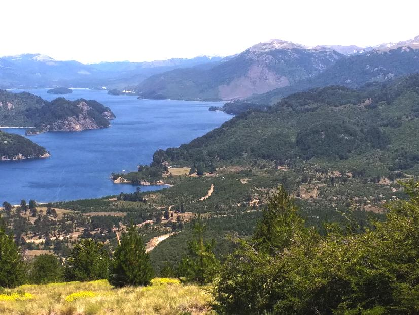

# Listas En La Montania
Ejemplo con listas y recursividad



Nos fuimos de mochileros a Bariloche y vamos a recorrer las montañas. 
Tenemos información de qué refugios hay en cada montania y a qué altura sobre el nivel del mar

```
tieneRefugio(catedral,frei,2012).
tieneRefugio(lopez,refugioLopez,1983).
tieneRefugio(tronador,ottoMeiling,2520).
```

También sabemos los grupos de amigues que quieren ir juntos de excursión a cada montaña

```
quierenIr(tronador,[juan,pedro,ana,sofia]).
quierenIr(lopez,[juan,carlos,julieta]).
quierenIr(lopez,[juan,carlos]).
quierenIr(catedral,[ana,sofia,juelita]).
quierenIr(lopez,[srPerez,sraGarcia,pequenioPerezGarcia,pequeniaPerezGarcia]).
```

Otra información con la que se cuenta es el peso de cada elemento del equipaje que llevan las personas.

```
equipaje(juan,[20,2,1]).
equipaje(ana,[16,1,5,8]).
equipaje(julieta,[20]).
```

Se quiere averiguar:

*  `cuantosQuierenIrJuntos(Montania,Cantidad)` Que relaciona la cantidad de personas que quieren ir juntas de excursio a una montaña.
*  `quiereIr(Montania,Persona)` Representa que una persona quiera ir a una montaña.
* `companieroDeExcursionAMasDeUnaMontania(Fulano,Mengano)` Relaciona dos personas si están juntas en un grupo, en dos excursiones a montanias diferentes.
* `puedeLlegar(Fulano,Refugio)` Indica si una persona puede llegar a subir a un refugio, teniendo en cuenta el peso de su equipaje y la altura del refugio. Se sabe que dicha altura no debe ser mayor a 50 veces el peso total de su equipaje.   
* Averiguar quien es el que lleva más cosas.
* **Difícil**: `montaniaRepetida(Montania)` Se considera repetida una montaña si existe algun grupo que vaya a esa montaña y que en otro momento, todos sus integrantes vuelvan a ir juntos en otra excursion al a misma montaña

